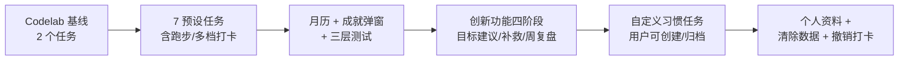

# 实习周报

**周报周期：** 2026-07-06 至 2026-07-10

## 一、本周主要内容

本周在两个 HarmonyOS 项目并行推进，合计 307 文件变更，+18704/-8736 行。

---

## 项目一：健康生活（NewHealthyLife）

菁英班主项目，从零实现「健康生活」习惯打卡应用。本周从 codelab 基线做到完整功能闭环，171 文件 +12855 行。



### 1. 数据层与领域模型 ✅

**[核心]** 定义 4 张表结构（任务表/日任务表/日信息表/补救表），实现 RDB 仓储 + Preferences 仓储。领域层拆分模型、常量、规则、工具四个子包，纯逻辑不依赖运行时。TaskInfo 扩展 12 个字段支持自定义任务，DatabaseHelper 含迁移逻辑（检测缺失列 → ALTER TABLE → 回填默认值）。

### 2. 7 个预设任务 + 自定义习惯任务 ✅

**[核心]** 早起/喝水/吃苹果/微笑/刷牙/早睡/跑步。其中微笑、刷牙改为可设次数（1/2/3 次），跑步为数值任务（1/2/3/5 公里）并支持周频率提醒。在此基础上进一步实现自定义习惯任务——用户可创建/编辑/归档自定义任务，含图标选择、目标值选择、提醒设置。预设任务和自定义任务统一通过 TaskDisplayMeta 解析展示信息。

### 3. 月历热力图 ✅

**[核心]** 6×7 日期网格，每日期显示完成状态圆点（全部完成=蓝色实心/部分完成=橙色实心/未完成=红色实心/无记录=空心圆环/有补救=蓝色描边）。支持跨月查看（上一月/下一月箭头），修复月底溢出 bug（3/31 -1 月→3/3 的问题）。选中日期显示子任务进度条。

### 4. 三层测试体系搭建 ✅

**[核心]** 从"无测试"到三层全覆盖，共 30+ 组测试用例：

| 测试层 | 文件 | 覆盖内容 |
|--------|------|----------|
| 本地单元 | LocalUnit / NumericCheckin / RegressionBugScan | 任务打卡逻辑、数值任务、回归扫描 |
| 业务流程（内存假仓库） | HomeStoreFlow / PersistenceSemantics | 启用→快照→打卡→连续天数→重启恢复→偏好持久化 |
| 设备端集成（真实 DB） | DeviceIntegration | 4 张表建表、CRUD、幂等、端到端链路 |
| 规则测试 | GoalSuggestion / Recovery / AchievementUpgrade / WeeklyReview / UserLevel / MonthView / CustomTask / ProfileStore | 智能目标建议、补救资格、成就解锁、周复盘、等级计算、月历导航、自定义任务、个人资料 |

**HomeStore 可测试性重构**：抽取 5 个仓储接口（ITaskRepository/IDayInfoRepository/IDayTaskRepository/IPrefRepository/IFormService），HomeStore 改为依赖接口。新增 `createForTest(deps)` 工厂方法 + FakeRepositories 内存假仓库，模拟真实持久化语义（upsert 去重、id 自增、深拷贝隔离），实现不启 UI 测完整用户路径。

```text
📁 entry/src/test/fakes/FakeRepositories.ets
↓ 内存假仓库模拟真实持久化语义，测完整用户路径不依赖设备
export class FakeTaskRepository implements ITaskRepository {
  private tasks: TaskInfo[] = [];       // 内存存储
  private nextId: number = 100;          // id 自增

  async ensureDefaultTasks() {
    if (this.tasks.length > 0) return;   // 幂等：已初始化不重复插入
    this.tasks.push(...createDefaultTasks());
  }

  async upsertDayTask(dt: DayTaskInfo): Promise<number> {
    // upsert 去重：相同 date+taskId 返回同一 id，不重复插入
    const existing = this.findExact(dt.date, dt.taskId);
    if (existing) { existing.isDone = dt.isDone; return existing.id; }
    const next = { ...dt, id: this.nextId++ };  // 深拷贝隔离
    this.dayTasks.push(next); return next.id;
  }
}
```

### 5. 创新功能四阶段实施 ✅

基于创新功能 SPEC，分 4 个 Phase 完整实施：

**Phase 1 月历稳定化**：打卡/启停任务/改目标后同步更新月历对应格状态，确保月历实时反映最新完成情况。

**Phase 2 智能目标调整**：根据最近 7 天完成率给出建议——连续 5 天完成→提高一档；7 天完成 <3 天→降低一档；3-4 天→保持。建议卡片嵌入编辑任务页，用户可一键采用。

**Phase 3 补救机制**：当天完成率 ≥70% 时可使用"补救"维持连续天数不中断。补救记录持久化到 RDB，每周限用一次，月历显示蓝色描边区分。补救后仍触发成就解锁判定。

**Phase 4 成就与周复盘**：成就从单一打卡里程碑升级为三类多维（稳定完成/恢复能力/全勤周）。周复盘卡片展示完成率、最稳定/最易遗漏任务、改善建议。

### 6. Bug 修复与体验优化 ✅

**[支撑]** 本周共修复 10+ 个 bug，代表性问题：

- **早睡/早起启用后页面不退出**：根因是提醒权限弹窗阻塞了页面返回。修复：提醒设置改为 fire-and-forget 不阻塞主流程，返回路由加 try-finally 保证必执行。
- **成就弹窗关闭不稳定**：关闭动作从内部 controller 改为外部控制，不依赖框架注入。
- **跑步提醒允许清空所有星期**：保存后 UI 显示开启但实际不调度。修复：最后一个选中天不允许取消并提示。
- **月历跨月月底溢出**：3/31 切上一月跳到 3/3。根因是 `Date.setMonth()` 在月底溢出，改为先 setDate(1) 再 setMonth，最后 clamp 到目标月最大天数。
- **用户等级写死 LV.7**：改为根据最大连续天数动态计算 7 档等级。
- **代码审查 6 个 bug**：周复盘任务名存资源 ID 数字、自定义任务关提醒不取消、打卡弹窗按钮文案逻辑等。

新增功能：清除所有数据（DELETE 所有业务表 + 重新初始化）、撤销打卡（ONCE/TIME 重置为空，VALUE 回退一档）、个人信息展示与编辑（头像/昵称/性别/出生日期/身高/体重）。

---

## 项目二：MomentX

横屏待机屏保应用，本周完成性能测试工具链落地 + 项目结构整理，136 文件 +5843/-8581 行（净减因为清理散落旧文档和截图）。

### 1. 性能测试自动化工具链 ✅

**[核心]** 上周完成 OH_Drawing 两个性能修复落地（脏矩形细化 4.5MB→0.5MB + 设置热重载），本周完成配套工具链：

- **性能测试自动化执行计划**：604 行计划 + 20 个采集脚本 + 4 个报告模板，覆盖三路径（ArkUI / OH_Drawing / DSL+Vulkan）× 四维度（CPU/内存/渲染/初始化），实现一键采集→解析→出中文报告。
- **单路径隔离开关**：新增 FORCE_RENDERER 开关，可单独挂载一种时钟页面，解决三路径共存导致 CPU/内存无法归因的问题。
- **多时钟压力场景**：新增 12/16 个时钟叠加网格，放大 ArkTS vs C++/GPU 的性能差异。
- **DevEco Profiler 调研**：确认 Profiler 无 CLI/API，底层工具（hiperf/hitrace/hidumper/hilog）全能命令行驱动，已覆盖四维，固化现有脚本流水线。

### 2. 项目结构整理 + GitCode 推送 ✅

**[支撑]** 面向外部读者做可读性优化，并推送至 GitCode：

- 新增根目录 README（项目概述 + 技术栈 + 架构目录树 + 构建命令 + 文档导航）。
- 三套时钟页面文件头补充对比注释，解释为什么有三个文件（多后端对比，非冗余）。
- GenUI 引擎路径从硬编码绝对路径改为三级 fallback（CMake 参数 > 环境变量 > 默认值），找不到源码时自动跳过编译。
- 签名密钥移出 git 跟踪，新建 template 模板（密码替换为占位符）。
- AI 工具配置（`.qoder/` / `.mimocode/` / `.workbuddy/`）移出跟踪，加入 `.gitignore`。

---

## 二、每天工作日志

| 日期 | 任务数 | 主要内容 |
|------|--------|----------|
| 周一 7/06 | 5 | MMX: OH_Drawing 修复落地 + 单路径隔离 + 多时钟压力 + 性能测试计划 + Profiler 调研 |
| 周二 7/07 | — | |
| 周三 7/08 | — | |
| 周四 7/09 | 9 | 健康生活: 基线搭建 + 7 预设任务 + 月历 + 成就弹窗 + 三层测试 + 跑步提醒 + 设备测试 |
| 周五 7/10 | 12 | 健康生活: 创新功能四阶段 + 自定义任务 + 个人资料 + 用户等级 + 清除数据 + 撤销打卡 + Bug 修复 / MMX: 项目整理 + GitCode 推送 |

每日产出趋势：█████████▌ ▌ ▌ ██████████████████▌ ████████████████████████▌

## 三、下周工作目标

**健康生活：**
1. ⏳ 完善 UI 视觉打磨（首页配色/图标/间距对齐设计稿）
2. ⏳ 服务卡片与手机端联动测试（打卡后卡片实时更新）
3. ⏳ 补写设备端 ohosTest 测试用例运行结果截图

**MomentX：**
1. ⏳ 跑单路径隔离 + 多时钟压力场景的性能采集，看 OH_Drawing 修复后实际数据
2. ⏳ 补测三钟功耗（拔 USB 用 Wi-Fi hdc 读电池电流电压）

## 四、实习目标

【固定占位：后续由用户提供】
